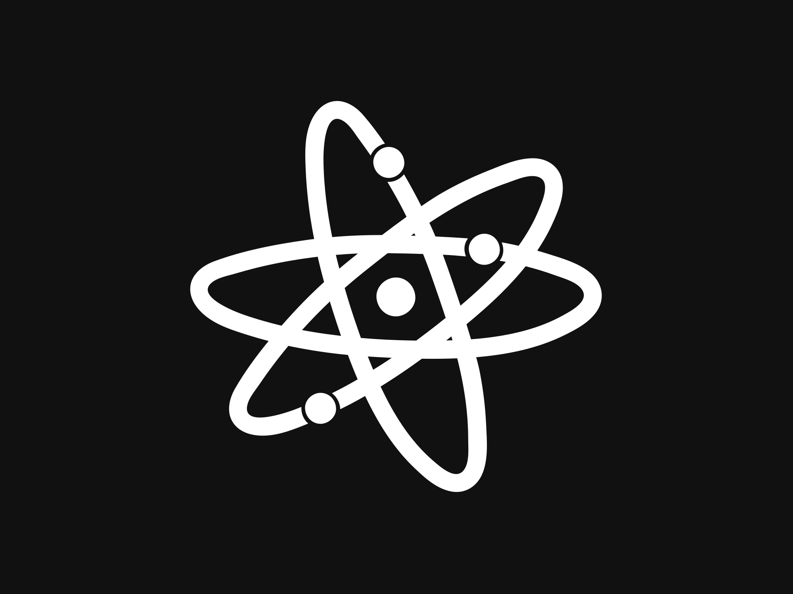

<!DOCTYPE html>
<html lang="en">
<head>
  <meta charset="UTF-8">
  <meta http-equiv="Content-Security-Policy" content="upgrade-insecure-requests">
  <meta name="viewport" content="width=device-width, initial-scale=1.0">
  <link rel="icon" type="image/png" href="/gallery_gen/quantum-dev-favicon.png">

  <title>QuantumDev</title>
  
</head>
<body>
  

    <!-- Profile Section -->
    

      
      <h1>QuantumDev</h1>
      

        UI Dev
      

      

        Owner & Main Developer @ LuckySAM Productions | Co-Owner, Lead HR, Lead Developer @ Waitrose Shopping | Former Developer @ Swirlys Cafe (deprecated) | Developer @ Pentagon Group | Owner @ Globe Hangout
      

    

    <!-- Introduction -->
    

      Hi! I'm Lakshin, a teenage developer with 3+ years of experience in Roblox Studio.
      My online name is QuantumDev.
      I’m passionate about coding, designing, and creating innovative projects. 
      My goal is to become a Full Stack Developer and start my own company in the future! 
      If you're looking to hire me for my Roblox Studio skills, feel free to reach out through my Discord server linked below.
        
      <i><b>"Don't Give Up On Life Or Life Will Give Up On You"</b></i>
      
- Lakshin

    

    <!-- Icons Section -->
    

      
      
      
      
      
    

  

</body>
</html>
